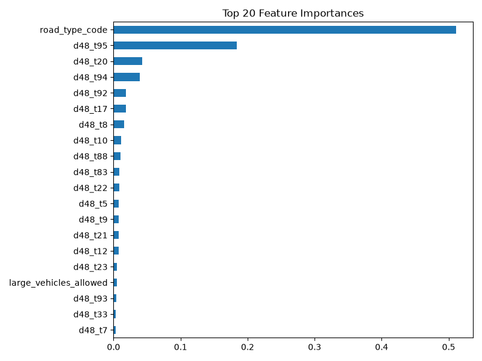
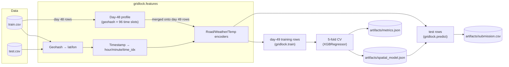
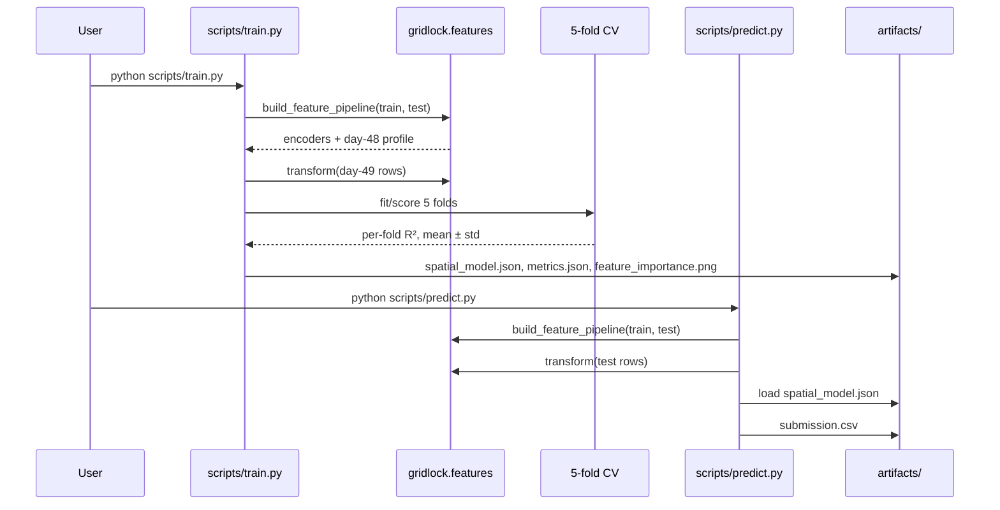

<div align="center">

# Flipkart Gridlock 2.0

### Predicting 15-minute traffic demand across 1,200+ geohashed city zones from a single day of historical signal

[](https://www.python.org/)
[](https://xgboost.readthedocs.io/)
[](tests/)
[](LICENSE)

</div>

<p align="center">
  
</p>

---

## Table of Contents

- [Overview](#overview)
- [Key Features](#key-features)
- [Tech Stack](#tech-stack)
- [System Architecture](#system-architecture)
- [Pipeline Flow](#pipeline-flow)
- [Data & ML Pipeline](#data--ml-pipeline)
- [Results & Model Performance](#results--model-performance)
- [Project Structure](#project-structure)
- [Getting Started](#getting-started)
- [Usage](#usage)
- [Testing](#testing)
- [Roadmap](#roadmap)
- [Contributing](#contributing)
- [License](#license)
- [Contact](#contact)

---

## Overview

**Problem:** Flipkart Gridlock 2.0 (HackerEarth) asks for a per-location, per-15-minute-interval traffic demand score (0–1) for a full day of a city, given only obfuscated `geohash` locations, a `timestamp`, road/vehicle metadata, and one preceding day of fully-labeled traffic history.

**Solution:** Geohashes are decoded into real lat/lon coordinates, timestamps into cyclical 15-minute time slots, and the one available historical day (day 48) is turned into a per-location, per-time-slot demand profile — a genuine "what happened here at this exact time, yesterday" signal. These, plus road/weather metadata, feed a single regularized XGBoost regressor, validated with 5-fold cross-validation instead of an unverifiable leaderboard number.

**Why it matters:** The dataset only spans two days, so the interesting engineering problem isn't stacking bigger models — it's building a historical-prior feature that cannot leak the label it is trying to predict, and proving that with an honest, reproducible validation score rather than a bare accuracy claim.

**Keywords:** `traffic-demand-prediction` `geospatial-ml` `time-series` `xgboost` `geohash-decoding` `feature-engineering` `regression` `hackathon`

## Key Features

| Feature | Description |
|---|---|
| Pure-Python geohash decoder | Decodes base32 geohashes to continuous `(lat, lon)` with no external geo library |
| Day-48 historical demand profile | Pivots the one fully-labeled day into a 96-slot-per-geohash demand curve, linearly interpolated and used as a leak-free prior for day 49 |
| Leak-free training split | Only day-49 rows (the day being forecast) are ever trained on — day 48 contributes exclusively via the profile feature, never as raw labeled rows |
| Shared feature pipeline | `build_feature_pipeline` / `transform` are the single source of truth for both training and inference, so the model and the script that serves it can never drift out of sync |
| 5-fold cross-validated R² | Every run reports a real, reproducible validation score (`artifacts/metrics.json`) instead of an unverifiable leaderboard screenshot |
| Unit-tested feature engineering | `pytest` suite covers geohash decoding and profile construction, including the unseen-geohash fallback path |

## Tech Stack

| Layer | Technology |
|---|---|
| Language | Python 3.10+ |
| Data manipulation | pandas, NumPy |
| Model | XGBoost (`XGBRegressor`) |
| Validation | scikit-learn (`KFold`, `r2_score`) |
| Visualization | Matplotlib |
| Testing | pytest |
| Interface | CLI scripts (`scripts/train.py`, `scripts/predict.py`) + a demo notebook |

## System Architecture

The pipeline is a single-machine batch job: raw CSVs in, a trained model and a submission file out. There is no served API — `gridlock.train` and `gridlock.predict` are the two entry points, and both route through the same `gridlock.features` module so encoding logic is defined exactly once.



## Pipeline Flow



## Data & ML Pipeline

### 1. Data Sources & Collection
- Provided by the Flipkart Gridlock 2.0 competition (HackerEarth): `dataset/train.csv` (77,299 rows) and `dataset/test.csv` (41,778 rows).
- The data covers exactly **two days** — day 48 (69,427 rows, fully labeled) and day 49 (7,872 labeled rows in train, 41,778 unlabeled rows in test, in 15-minute intervals across 1,249 distinct geohashes).

### 2. Data Cleaning
- `RoadType` and `Weather` are ~0.8% and ~1.0% missing respectively → filled as an explicit `"Unknown"` category before encoding, so missingness itself stays a learnable signal.
- `Temperature` is ~3.2% missing → filled with the training-set median; a companion `temperature_missing` flag preserves the fact that it was imputed.
- Geohashes appearing in `test.csv` but never seen in `train.csv`'s day 48 (10 of 1,190) fall back to the global day-48 profile rather than `NaN`.

### 3. Transformation & Feature Engineering
- **Geohash decoding:** a pure-Python base32 decoder turns each geohash into a continuous `(lat, lon)` center-point, so the tree model can learn real spatial splits instead of treating locations as unrelated categories.
- **Cyclical time index:** `H:M` timestamps become `hour`, `minute`, and a monotonic `time_idx` (0–95) marking the 15-minute slot in the day.
- **Day-48 historical profile (the key feature):** day-48 demand is pivoted into a `geohash × 96 time-slot` table, linearly interpolated across gaps, and merged onto every day-49 row (train and test alike) by `geohash`. A single `d48_same_time` feature also pulls out just the slot matching each row's own `time_idx` — "what was demand here at this exact time, yesterday."
- **Road/vehicle/weather encoding:** `RoadType` and `Weather` are label-encoded from the combined train+test category set (feature values only, never test labels); `LargeVehicles` and `Landmarks` become binary flags; `NumberofLanes` is used as-is.
- 109 total features per row.

### 4. Model Training
- Single `XGBRegressor` (`max_depth=6`, `n_estimators=600`, `learning_rate=0.05`, L1/L2 regularization) — deliberately shallower than the very deep trees (`max_depth=16`) used in earlier iterations of this project, since the leak-free training set is only 7,872 rows and needs regularization, not capacity.
- **Training rows = day 49 only.** Day 48 is never trained on directly — it only ever contributes through the profile feature — which is what prevents the model from trivially "predicting" a day-48 row's own demand back at itself.
- Configuration lives in [`src/gridlock/config.py`](src/gridlock/config.py); no manual hyperparameter search was needed at this data scale.

### 5. Evaluation
- **5-fold `KFold` cross-validation** (shuffled, `random_state=42`) on the 7,872 day-49 training rows — the only labeled data whose distribution matches the actual test set.
- Metric: **R²**, matching the competition's own scoring formula (`max(0, R² × 100)`).
- Every training run writes its fold-by-fold scores to `artifacts/metrics.json`, so the number in this README is exactly reproducible by running `scripts/train.py`.

## Results & Model Performance

| Fold | R² |
|---|---|
| 1 | 0.9589 |
| 2 | 0.9608 |
| 3 | 0.9578 |
| 4 | 0.9518 |
| 5 | 0.9593 |
| **Mean ± std** | **0.9577 ± 0.0031** |

The dominant feature by a wide margin is `RoadType` (≈51% of gain) — `Highway` rows average 0.57 demand versus 0.06 for `Residential`, a genuinely strong real-world signal — followed by the day-48 profile slots. Spatial coordinates alone (`lat`/`lon`) carry comparatively little weight once the profile and road-type features are present, which makes sense: they're already implicitly captured by "what happened at this geohash yesterday."

## Project Structure

```
Flipkart-Gridlock-2.0/
├── dataset/
│   ├── train.csv              # 77,299 rows, days 48 & 49, labeled
│   ├── test.csv                # 41,778 rows, day 49, unlabeled
│   └── sample_submission.csv
├── src/gridlock/
│   ├── config.py                # paths, split strategy, XGBoost hyperparameters
│   ├── features.py              # geohash/time decoding, day-48 profile, encoders
│   ├── train.py                 # CV + final fit + metrics/plot export
│   └── predict.py               # loads the model, writes submission.csv
├── scripts/
│   ├── train.py                 # CLI: python scripts/train.py
│   └── predict.py               # CLI: python scripts/predict.py
├── tests/
│   └── test_features.py         # geohash decoding + profile construction
├── notebooks/
│   └── inference_demo.ipynb     # end-to-end walkthrough using the same src/gridlock code
├── docs/
│   ├── APPROACH.md              # detailed methodology write-up
│   └── feature_importance.png
├── artifacts/                   # generated locally by train/predict — not committed
├── requirements.txt
└── README.md
```

## Getting Started

### Prerequisites
- Python 3.10+

### Installation

```bash
git clone https://github.com/adarshcod30/Flipkart-Gridlock-2.0.git
cd Flipkart-Gridlock-2.0
python3 -m venv .venv && source .venv/bin/activate
pip install -r requirements.txt
```

### Run Locally

```bash
python scripts/train.py     # trains + cross-validates, writes artifacts/spatial_model.json
python scripts/predict.py   # writes artifacts/submission.csv
```

## Usage

Both entry points are plain CLI scripts — no arguments, no server:

```bash
python scripts/train.py
# Loading data and building features...
# Training rows: 7872 | features: 109
# Running 5-fold cross-validation...
#   fold 1: R2 = 0.9589
#   ...
# CV R2: 0.9577 +/- 0.0031
# Model saved to artifacts/spatial_model.json

python scripts/predict.py
# Saved 41778 predictions to artifacts/submission.csv
```

For an annotated walkthrough of the same steps, see [`notebooks/inference_demo.ipynb`](notebooks/inference_demo.ipynb).

## Testing

```bash
pytest tests/ -v
```

Covers geohash decoding (bounds, determinism, distinctness) and the day-48 profile pipeline (correct column shape, no residual NaNs after interpolation, correct fallback for geohashes never seen in day 48).

## Roadmap

- [ ] Add a held-out spatial split (unseen geohashes only) alongside the current random K-fold, to separately measure generalization to new locations
- [ ] Try target-encoded interaction features (`RoadType × time_idx`), the single highest-value feature family in earlier iterations of this project
- [ ] Track experiments (params, CV score, feature set) across runs instead of overwriting `artifacts/metrics.json`

## Contributing

This is a personal competition project and isn't currently seeking external contributions, but issues and suggestions are welcome.

## License

Distributed under the MIT License. See [`LICENSE`](LICENSE) for details.

## Contact

**Adarsh** — [GitHub @adarshcod30](https://github.com/adarshcod30)

Project Link: [https://github.com/adarshcod30/Flipkart-Gridlock-2.0](https://github.com/adarshcod30/Flipkart-Gridlock-2.0)
